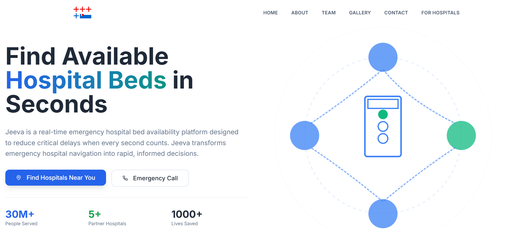

# JEEVA - Real Time Hospital Bed Availability Platform



JEEVA is a website that helps people quickly find hospitals with available beds during medical emergencies. It shows real-time bed availability so families can save time and make faster decisions.

🌐 Website: https://www.thejeeva.in/


## About :

During emergencies, people often waste time calling different hospitals to check bed availability. JEEVA solves this problem by showing live hospital bed status in one place.

The goal is to make emergency healthcare faster, easier, and more transparent.


## Features :

- Real-time hospital bed availability
- Simple and clean user interface
- Color-coded status (Available, Limited, Full)
- One-click hospital calling
- Quick hospital search


## Tech Stack :

- React.js
- Tailwind CSS
- Modern responsive design


## Getting Started :

### Clone the repository
```git clone <repository-url>```

### Install dependencies
```npm install```

### Run the project
```npm run dev```


## 📊 Impact

- Helps users find hospital beds faster
- Reduces time wasted during emergencies
- Supports hospitals with real-time updates


## Contribution :

Contributions are welcome. You can fork the repo and create a pull request !

---

## Contact :

Email : hello@jeeva.care  
Location : Bhubaneswar, Odisha


> Made with ❤️ by [Asutosh](https://www.linkedin.com/in/asutoshsahoo/)